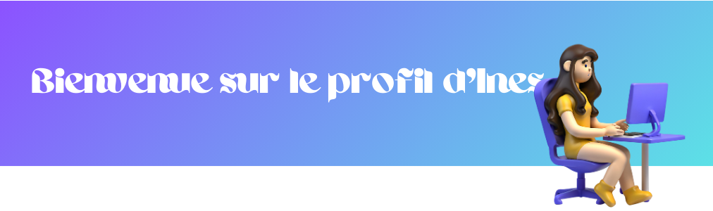

  
  

      
    
 𝑴𝒐𝒊 𝒄'𝒆𝒔𝒕 𝑰𝒏𝒆𝒔 𝑨𝒎𝒛𝒆𝒓𝒕.

    
 𝑱𝒆 𝒔𝒖𝒊𝒔 é𝒕𝒖𝒅𝒊𝒂𝒏𝒕𝒆 𝒆𝒏 𝒊𝒏𝒇𝒐𝒓𝒎𝒂𝒕𝒊𝒒𝒖𝒆 𝒆𝒏 5è𝒎𝒆 𝒂𝒏𝒏é𝒆 à 𝑷𝒐𝒍𝒚𝒕𝒆𝒄𝒉 𝑴𝒐𝒏𝒕𝒑𝒆𝒍𝒍𝒊𝒆𝒓.

    
 𝐏𝒂𝒔𝒔𝒊𝒐𝒏𝒏é𝒆 𝒑𝒂𝒓 𝐥'𝐚𝐫𝐭 𝐞𝐭 𝐥𝐞𝐬 𝐣𝐞𝐮𝐱 𝐯𝐢𝐝é𝐨.

    
 𝐓𝐨𝐮𝐣𝐨𝐮𝐫𝐬 𝒐𝒖𝒗𝒆𝒓𝒕𝒆 à 𝒅é𝒄𝒐𝒖𝒗𝒓𝒊𝒓 𝒅𝒆 𝒏𝒐𝒖𝒗𝒆𝒍𝒍𝒆𝒔 𝒄𝒉𝒐𝒔𝒆𝒔.

  

  
<h2 align="center">𝑪𝒐𝒏𝒏𝒂𝒊𝒔𝒔𝒂𝒏𝒄𝒆𝒔</h2>

<a href="https://skillicons.dev">
  <h3 align="center">𝑳𝒂𝒏𝒈𝒂𝒈𝒆𝒔 𝒅𝒆 𝑷𝒓𝒐𝒈𝒓𝒂𝒎𝒎𝒂𝒕𝒊𝒐𝒏</h3>
        

  
        

    <h3 align="center">𝑭𝒓𝒂𝒎𝒆𝒘𝒐𝒓𝒌𝒔 𝒆𝒕 𝑩𝒊𝒃𝒍𝒊𝒐𝒕𝒉è𝒒𝒖𝒆𝒔</h3>
      

  
      

    <h3 align="center">𝑩𝒂𝒔𝒆𝒔 𝒅𝒆 𝑫𝒐𝒏𝒏é𝒆𝒔</h3>
    

  
    

  <h3 align="center">𝑶𝒖𝒕𝒊𝒍𝒔 𝒆𝒕 𝑬𝒏𝒗𝒊𝒓𝒐𝒏𝒏𝒆𝒎𝒆𝒏𝒕𝒔 𝒅𝒆 𝑫é𝒗𝒆𝒍𝒐𝒑𝒑𝒆𝒎𝒆𝒏𝒕</h3>
  

  
  
  

</a>

<h2 align="center">𝑺𝒕𝒂𝒕𝒊𝒔𝒕𝒊𝒒𝒖𝒆𝒔</h2>

  
  
  
    

###

