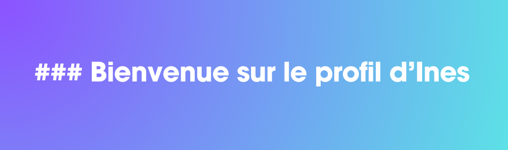

Moi c'est Ines Amzert. Je suis étudiante en informatique en 4ème année à Polytech Montpellier, passionnée par les jeux vidéo et l'art en général.
Je suis toujours ouverte à découvrir de nouvelles choses.

<h2 align="center">🔥 Langages-Frameworks-Outils 🔥</h2>

<a href="https://skillicons.dev">
  <h4 align="center">Langages de Programmation</h4>
        

  
        

    <h4 align="center">Frameworks et Bibliothèques</h4>
      

  
      

    <h4 align="center">Bases de Données</h4>
    

  
    

  <h4 align="center">Outils et Environnements de Développement</h4>
  

  
  
  

</a>
 

 

